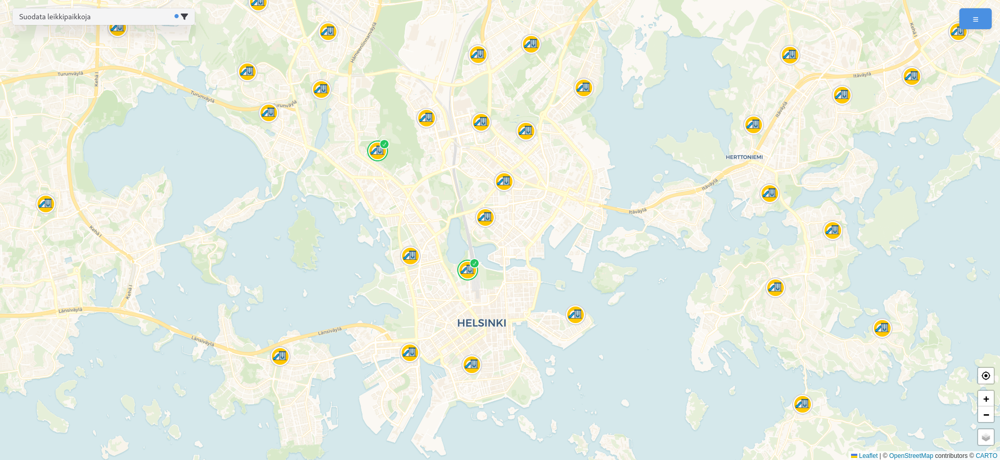

# PlayGrounder

An interactive web application to help parents and caregivers find and share local playgrounds. Built with React, Vite, and Chakra UI, using Supabase for the backend.




## Features

- Interactive map showing nearby playgrounds
- User authentication for tracking visited playgrounds
- Rating system
- Mobile-friendly design

## Tech Stack

- React + TypeScript
- Vite for build tooling
- Chakra UI for components
- Leaflet for maps
- Supabase for backend and authentication

## Development

Clone the repository:
```bash
git clone https://github.com/jopppis/playgrounder.git
cd playgrounder
```

Install dependencies:
```bash
npm install
```

```bash
npx supabase start
```

Create a `.env.local`, `.env.development` or `.env.production` file from the `.env.example` file and fill in the values. `npx supabase start` will output the values for `VITE_SUPABASE_URL` and `VITE_SUPABASE_ANON_KEY`.

Start the development server:
```bash
npm run dev
```

## TODO

- Add more Finnish cities
- Security audit
- Run coverage and improve it
- Linter warnings
- Check dependencies
- Update deps

## Contributing

Contributions are welcome! Please feel free to submit a Pull Request.
